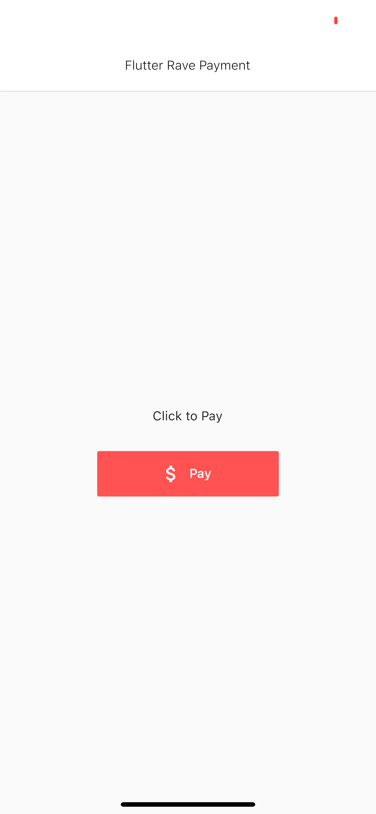

# Rave by Flutterwave Plugin for Flutter

[](https://pub.dartlang.org/packages/flutter_rave)

A Flutter plugin for making payments via Rave by Flutterwave Payment Gateway. Fully
supports Android and iOS.

<div style="text-align: center">
    <table>
        <tr>
            <td style="text-align: center">
                
            </td>
            <td style="text-align: center">
                
            </td>
        </tr>
    </table>
</div>


## Installation
To use this plugin, add `flutter_rave` as a [dependency in your pubspec.yaml file](https://flutter.io/platform-plugins/).

Then initialize the plugin preferably in the `initState` of your widget.

``` dart
import 'package:flutter_rave/flutter_rave.dart';

class _MyHomePageState extends State<MyHomePage> {
  @override
  Widget build(BuildContext context) {
    return Scaffold(
      appBar: AppBar(
        title: Text(widget.title),
      ),
      body: Builder(
        builder: (context) => SingleChildScrollView(
              child: Column(
                mainAxisAlignment: MainAxisAlignment.start,
                children: <Widget>[
                  Text(
                    'Pay Me',
                  ),
                  FlatButton.icon(
                    onPressed: () {
                      _pay(context);
                    },
                    icon: Icon(Icons.email),
                    label: Text("Pay"),
                  ),
                ],
              ),
            ),
      ),
    );
  }

  _pay(BuildContext context) {
    final _rave = RaveCardPayment(
      isDemo: true,
      encKey: "c53e399709de57d42e2e36ca",
      publicKey: "FLWPUBK-d97d92534644f21f8c50802f0ff44e02-X",
      transactionRef: "SCH${DateTime.now().millisecondsSinceEpoch}",
      amount: 100,
      email: "demo1@example.com",
      onSuccess: (response) {
        print("$response");
        print("Transaction Successful");

        if (mounted) {
          Scaffold.of(context).showSnackBar(
            SnackBar(
              content: Text("Transaction Sucessful!"),
              backgroundColor: Colors.green,
              duration: Duration(
                seconds: 5,
              ),
            ),
          );
        }
      },
      onFailure: (err) {
        print("$err");
        print("Transaction failed");
      },
      onClosed: () {
        print("Transaction closed");
      },
      context: context,
    );

    _rave.process();
  }
}
```

No other configuration required&mdash;the plugin works out of the box.

## Running Example project
For help getting started with Flutter, view the online [documentation](https://flutter.io/).

An [example project](https://github.com/akacokafor/flutter_rave/tree/master/example) has been provided in this plugin.
Clone this repo and navigate to the **example** folder. Open it with a supported IDE or execute `flutter run` from that folder in terminal.

## Contributing, Issues and Bug Reports
The project is open to public contribution. Please feel very free to contribute.
Experienced an issue or want to report a bug? Please, [report it here](https://github.com/akacokafor/flutter_rave/issues). Remember to be as descriptive as possible.
